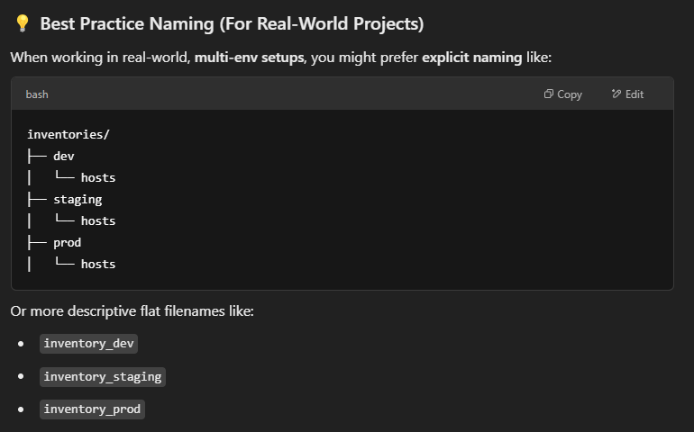

# Jenkins - Continue

For the next part in my course, tutor has installed Ansible inside our jenkins container. And seems like it we will use this tool a lot and i guess this tool is used mostly for ssh jobs. Our current containers are like this:

 - **jenkins**: Which has ansible inside it.
 - **mysql**: Which  
 - **remote-host**: Which we are trying to do jobs through this host for better practice.

Ansible uses inventory for controlling jobs(in our case its ssh). So we just created a ansible inventory like this:

    [all:vars]

    ansible_connection = ssh

    [test]
    test1 ansible_host=remote-host ansible_user=remote_user ansible_private_key_file=/var/jenkins_home/ansible/remote-key

### What this codes do?

As I understand that ansible has its own syntax in order to understand the commands. Here we are telling ansible how to connect and what settings to use. In order to understand inventories, we have to know that **hosts files are our inventories**

According go ChatGPT this is mostly the best practice considering real-world projects:

With `[all:vars]` we are declaring global variables that will be used in the hosts file. By the way hosts files are our inventories. 

With `ansible_connection = ssh` we are telling to the ansible that we will be using SSH to connect to the Hosts.

With `[test]` we are defining group.

After that we are telling ansible what should our hosts name should be which is `test1`. Note that while using this hosts, we can easily access this host via this name.

Then all we have to do in the last line is to manage our host's information in a way that ansible accepts them.
    
    test1 ansible_host=remote-host ansible_user=remote_user ansible_private_key_file=/var/jenkins_home/ansible/remote-key

